  

what do the remarks mean?

 

| remark | last push |
|---|---|
| 🟢 `BOARDING` | ≤ 2 days |
| 🟡 `LAST CALL` | ≤ 1 week |
| 🟢 `GO TO GATE` | ≤ 3 weeks |
| ⚪ `ON TIME` | ≤ 45 days |
| 🟠 `DELAYED` / `EXP hh:mm` | ≤ 5 months (the estimate is reshuffled daily) |
| 🟣 `DIVERTED` | quiet for 45+ days with 3+ open issues |
| 🟠 `GATE CLOSED` | ≤ 1 year |
| ⚫ `DEPARTED` | ≤ 3 years |
| 🔵 `LANDED` | older, done and dusted |
| 🔴 `CANCELLED` | archived |

  

  <a href="https://github.com/ehosta/ehosta/issues/new?title=Boarding%20pass&body=Just%20hit%20%E2%80%9CCreate%E2%80%9D%20%E2%80%94%20your%20boarding%20pass%20is%20printed%20in%20about%2030%20seconds%2C%20right%20here.%20%E2%9C%88%EF%B8%8F"><b>✈ Book a seat</b></a>
   
  get your own boarding pass, bound for your main language

  
    <a href="https://github.com/SpinUp-CLI/spinup">spinup</a> ·
    <a href="https://github.com/mdourdoi/ft_transcendance">ft_transcendance</a> ·
    <a href="https://github.com/ehosta/brainfxcker">brainfxcker</a> ·
    <a href="https://github.com/ehosta?tab=repositories">all flights</a>
  

